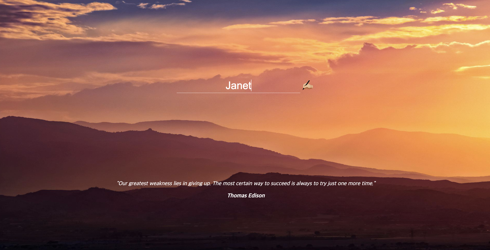

# To-do-list Application with React

## 1. Description

- To-do-list web site using local storage in React.

## 2. URL

- https://jiyaho.github.io/react-toDoApp/

## 3. Screenshot





## 4. Feature Description

- 사용자 로그인 (localStorage에 사용자 정보 저장)
- 인용문구: 사용자 로그인 전 화면 하단 부에 인용문구 랜덤으로 표출
- 사용자가 로그인하면 To Do 작성 페이지로 이동
- 사용자 로그아웃 (Log-out 버튼 클릭 시 localStorage의 데이터들 모두 삭제 후 로그인 전 화면으로 이동)
- To Do List 추가: 사용자 로그인 후 Input Box에 To Do 작성 시, 데이터는 localStorage에 저장되고 페이지에 저장해둔 To Do List 렌더링
- To Do List 삭제: 추가한 리스트 우측 "❌" 버튼 눌러 삭제
- 날짜: 일 / 월 / 년도 순으로 화면에 표출
- 날씨: 사용자의 현재 위치 허용 시, 화면에 날씨 및 도시 표출
- 시간: 현재 시각 표출
- 사용자 환영 문구: 로그인한 사용자 이름 및 인사 문구 화면 중앙부에 표출

## 5. Used Skills
- React.js
- CSS.module
- Local Storage
  
## 6. File Tree Structure

```
📦 react-toDoApp
├─ .gitignore
├─ README.md
├─ package-lock.json
├─ package.json
├─ public
└─ src
   ├─ App.js
   ├─ components
   │  ├─ BgImg.js
   │  ├─ Clock.js
   │  ├─ Login.js
   │  ├─ Quotes.js
   │  ├─ Todo.js
   │  └─ WeatherAPI.js
   ├─ css
   │  ├─ BgImg.module.css
   │  ├─ Clock.module.css
   │  ├─ Login.module.css
   │  ├─ Todo.module.css
   │  └─ WeatherAPI.module.css
   └─ index.js
```
